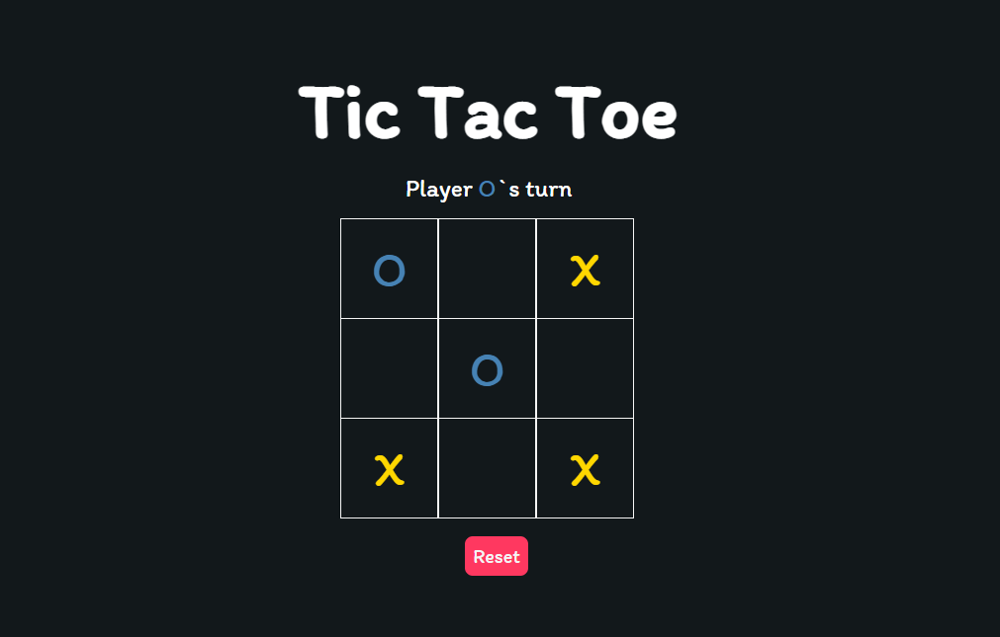

<h1 align="center"> Tic Tac Toe</h1>

Acesse a Demo da solução [aqui](https://marcelymelo.github.io/Tic-Tac-Toe-JavaScript/)!

Neste projeto reproduzo o jogo Tic Tac Toe - o famoso "jogo da velha" - apenas com HTML, CSS e JavaScript. Nele utilizei pela primeira vez - num cenário real - arrow functions e operadores lógicos de comparação específicos, além de poder aplicar e revisar os conceitos de lógica de programação.

Este projeto foi realizado com base no canal [JavaScript Academy](https://www.youtube.com/channel/UCicOwFWkuMX0ddFaKCc_E5Q).
